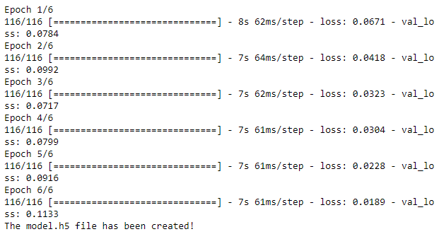

# Behavioral Cloning Project

## Overview
---


(Vehicle driving autonomously)

In this project, a convolutional neural network is trained to clone a driving behavior from a simulator.
The CNN architecture used here is referenced from NVIDIA's ***End to End Learning for Self-Driving Cars paper***.   
**Reference:** https://arxiv.org/pdf/1604.07316v1.pdf

This repository contains follwoing five files:

* model.py (script to create and train the model)
* drive.py (script to drive the car - feel free to modify this file)
* model.h5 (a trained Keras model)
* a report writeup file (the document you are reading right now)
* video.mp4 (a video recording of the vehicle driving autonomously around the track for one full lap)

## Environment
---
you need the simulator.


I try to run on my locally end, but there are too many problem for version, so I used the workpace on udacity.

The Goal of the Project
---
The goal is to create and to validate of a CNN model that clones a driving behavior from a simulator.  
Simulator allows to collect data in the format shown below:


Here, only 3 camera images (center, left, right) and corresponding steering angles are used to train the model.  
Thus, the outcome of the model is the steering angle.  


## Data Collection Strategy
---
The data is collected via the simulator.  
While collecting the data, only 1 loop has been conducted as follows:
1. One round of data was collected by **staying in the middle line** as much as possible and making **smooth turns**
2. Totally use 1694*3 (center, left and right) for training.


## The Model
---

### 1. An appropriate model architecture has been employed
My architecture is using Keras Sequential() method and base on NVIDIA's End to End Learning for Self-Driving Cars paper.  
**Reference:** https://arxiv.org/pdf/1604.07316v1.pdf


---

### 2. Attempts to reduce overfitting in the model

The model contains dropout layers in order to reduce overfitting. <br>
The model was trained and validated on different data sets to ensure that the model was not overfitting. <br>
The model was using 6th epochs. <br>


---

### 3. Model parameter tuning

The model used an adam optimizer, so the learning rate was not tuned manually.<br>
The model used Dropout rate was 0.5.<br>
The model used epochs rate was 6.<br>
The Architecture

---

### 4. Appropriate training data
Training data was chosen to keep the vehicle driving on the road. I used a combination of center lane driving, recovering from the left and right sides of the road.<br>
I am not a good driver. I try my best to keep the car on the center of road.<br>
I totally use 4611 record to train.

---

### 5. The architecture

```
Model: "sequential"
_________________________________________________________________
Layer (type)                 Output Shape              Param #   
=================================================================
cropping2d (Cropping2D)      (None, 90, 320, 3)        0         
_________________________________________________________________
lambda (Lambda)              (None, 200, 66, 3)        0         
_________________________________________________________________
lambda_1 (Lambda)            (None, 200, 66, 3)        0         
_________________________________________________________________
conv2d (Conv2D)              (None, 98, 31, 24)        1824      
_________________________________________________________________
conv2d_1 (Conv2D)            (None, 47, 14, 36)        21636     
_________________________________________________________________
conv2d_2 (Conv2D)            (None, 22, 5, 48)         43248     
_________________________________________________________________
conv2d_3 (Conv2D)            (None, 20, 3, 64)         27712     
_________________________________________________________________
conv2d_4 (Conv2D)            (None, 18, 1, 64)         36928     
_________________________________________________________________
dropout (Dropout)            (None, 18, 1, 64)         0         
_________________________________________________________________
flatten (Flatten)            (None, 1152)              0         
_________________________________________________________________
dense (Dense)                (None, 100)               115300    
_________________________________________________________________
dense_1 (Dense)              (None, 50)                5050      
_________________________________________________________________
dense_2 (Dense)              (None, 10)                510       
_________________________________________________________________
dense_3 (Dense)              (None, 1)                 11        
=================================================================
Total params: 252,219
Trainable params: 252,219
Non-trainable params: 0
```
## Result
I try to be simple,so only trained one lap.

see the result gif


## Suggestions
1.Environment-Because I can't run on local end, so I can't improve my model freguently. I can get better model on local end.<br/>
2.Improve model- The model architecture is base on NVIDIA's. It has some space to improve.
3.Data clear- some data maybe are bad(bad-control,wrong-control) which need  delete to improve model.
