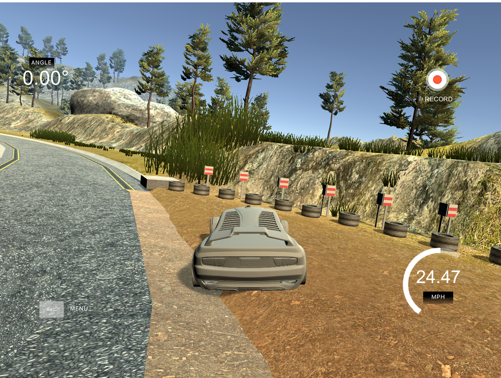
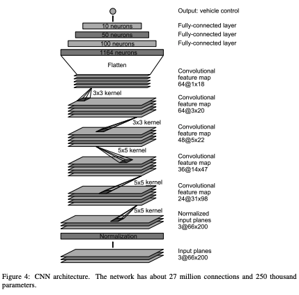
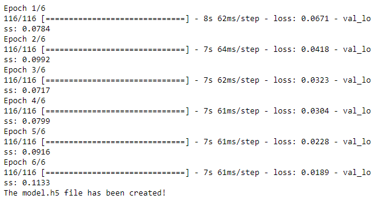

# Self-Driving Car Engineer Nanodegree


**Behavioral Cloning Project**

The goals / steps of this project are the following:
* Use the simulator to collect data of good driving behavior
* Build, a convolution neural network in Keras that predicts steering angles from images
* Train and validate the model with a training and validation set
* Test that the model successfully drives around track one without leaving the road
* Summarize the results with a written report



----

## 1. An appropriate model architecture has been employed
My architecture is using Keras Sequential() method and base on NVIDIA's End to End Learning for Self-Driving Cars paper.  
**Reference:** https://arxiv.org/pdf/1604.07316v1.pdf



----

## 2. Attempts to reduce overfitting in the model

The model contains dropout layers in order to reduce overfitting. <br>
The model was trained and validated on different data sets to ensure that the model was not overfitting. <br>
The model was using 6th epochs. <br>


----

## 3. Model parameter tuning

The model used an adam optimizer, so the learning rate was not tuned manually.<br>
The model used Dropout rate was 0.5.<br>
The model used epochs rate was 6.<br>

## 4. Appropriate training data
Training data was chosen to keep the vehicle driving on the road. I used a combination of center lane driving, recovering from the left and right sides of the road.<br>
I am not a good driver. I try my best to keep the car on the center of road.<br>
I totally use 1694*3 record to train.


```python

```
